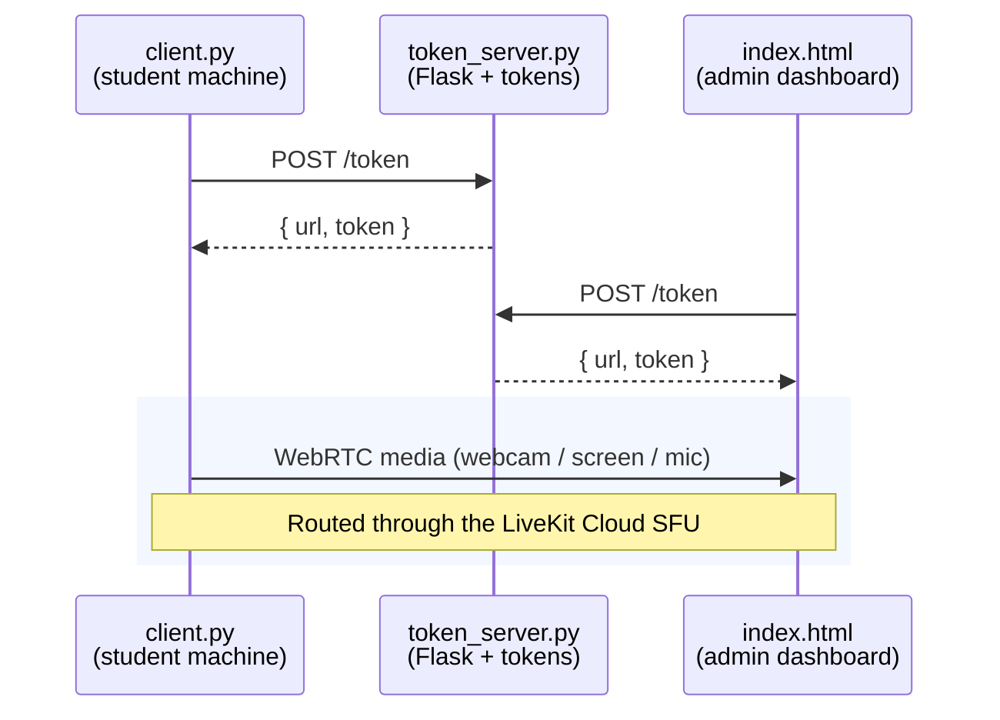

# Online Exam Proctoring System


[](https://camera-mic-screen-share-caputure-in.onrender.com)
[](https://livekit.io)

[](https://github.com/Binidu01/Camera-mic-screen-share-caputure-in-silent/stargazers)
[](https://github.com/Binidu01/Camera-mic-screen-share-caputure-in-silent/network/members)
[](https://github.com/Binidu01/Camera-mic-screen-share-caputure-in-silent/issues)
[](https://github.com/Binidu01/Camera-mic-screen-share-caputure-in-silent/blob/main/LICENSE)

A real-time, browser-based exam monitoring tool that streams live webcam video, screen activity, and microphone audio from a student's machine to an instructor dashboard. Built with Python, LiveKit (WebRTC), and Flask.

---

## Table of Contents

- [Overview](#overview)
- [Features](#features)
- [Architecture](#architecture)
- [Technology Stack](#technology-stack)
- [Prerequisites](#prerequisites)
- [Installation](#installation)
- [Configuration](#configuration)
- [Running the System](#running-the-system)
- [Deployment](#deployment)
- [Configuration Reference](#configuration-reference)
- [Security Considerations](#security-considerations)
- [Troubleshooting](#troubleshooting)
- [Ethical Use and Disclaimer](#ethical-use-and-disclaimer)
- [License](#license)

---

## Overview

The Online Exam Proctoring System provides near real-time monitoring of a student's environment during an online assessment. It captures three concurrent media streams — webcam, screen share, and microphone — encodes them client-side, and publishes them over WebRTC to a LiveKit room. An instructor viewing the dashboard subscribes to those tracks and sees them in a unified monitoring console.

The system is designed for low bandwidth and low CPU overhead on the student machine, with adaptive stream quality handled automatically by the WebRTC transport layer.

---

## Features

- **Live Webcam Feed** — Continuous video of the student's surroundings.
- **Live Screen Sharing** — Real-time view of the student's primary monitor.
- **Microphone Streaming** — Background audio with a live level meter on the dashboard.
- **Low-Latency WebRTC Transport** — Powered by LiveKit Cloud with adaptive streaming and dynacast.
- **Token-Based Authentication** — Short-lived JSON Web Tokens issued by the backend; API secrets never reach the browser.
- **Per-Track State Indicators** — Dashboard displays idle/live state for each media source independently.
- **Graceful Shutdown** — Signal handlers allow clean teardown of capture devices and WebRTC connections.

---

## Architecture

The system consists of three components:



> Both the publisher (`client.py`) and the viewer (`index.html`) independently request short-lived tokens from `token_server.py`, then connect directly to LiveKit Cloud. Media never passes through the token server — only the JWTs do.

### Component Responsibilities

| Component              | Role                                                                                                                               |
| ----------------------- | ----------------------------------------------------------------------------------------------------------------------------------- |
| `client.py`            | Runs on the student machine. Fetches a publisher token, connects to LiveKit, and publishes webcam, screen, and microphone tracks. |
| [`token_server.py`](https://github.com/Binidu01/Camera-mic-screen-share-caputure-in-silent/blob/main/token_server.py) | Flask backend. Issues LiveKit JWTs to both publisher and viewer. Holds API credentials; never exposes them to the browser. |
| `templates/index.html` | Admin dashboard. Fetches a viewer token, connects to LiveKit, and renders subscribed tracks.                                      |

---

## Technology Stack

**Backend**
- Python 3.9+
- Flask
- Flask-CORS
- `livekit-api` (server SDK for JWT generation)
- `python-dotenv`

**Client (Capture)**
- OpenCV (`cv2`) — webcam capture
- `mss` — screen capture
- `sounddevice` — microphone capture
- NumPy — frame manipulation
- `requests` — token retrieval
- `livekit` (Python RTC SDK) — media publishing

**Frontend**
- HTML5, CSS3, vanilla JavaScript
- `livekit-client` UMD build (CDN)

**Infrastructure**
- LiveKit Cloud (WebRTC SFU)
- Render / Railway / Replit (token server hosting)

---

## Prerequisites

- **For students (recommended path):** nothing but Windows and a webcam/microphone — the prebuilt `client.exe` from [Releases](https://github.com/Binidu01/Camera-mic-screen-share-caputure-in-silent/releases) needs no Python install.
- **For running `client.py` from source instead:** Python 3.9 or newer.
- A webcam and microphone on the student machine (screen share works without these).
- A modern browser (Chrome, Edge, Firefox, Safari) on the instructor's machine.
- Network access on UDP/TCP port 7882 (WebRTC media) and TCP 443 (signaling) to reach LiveKit Cloud.
- A LiveKit Cloud account with a project and API key — **only needed if self-hosting your own `token_server.py`.** Sign up at [livekit.io](https://livekit.io). Using the [live demo](https://camera-mic-screen-share-caputure-in.onrender.com/) requires no LiveKit account of your own.

---

## Installation

> **Most students don't need to install anything.** The teacher shares the prebuilt `client.exe` from [Releases](https://github.com/Binidu01/Camera-mic-screen-share-caputure-in-silent/releases) — the student just downloads and runs it. `token_server.py` and `templates/index.html` are already deployed at the [live demo](https://camera-mic-screen-share-caputure-in.onrender.com/), so there's nothing to host either. The steps below are only for running `client.py` from source, or for self-hosting the server.

### Option A: Prebuilt executable (recommended for students)

1. Go to the [Releases page](https://github.com/Binidu01/Camera-mic-screen-share-caputure-in-silent/releases).
2. Download the latest `client.exe`.
3. Run it. Windows/SmartScreen and the app itself will prompt for confirmation before anything starts — capture only begins once the student accepts.

No Python, no dependencies, nothing else to configure.

### Option B: Run `client.py` from source

**1. Clone the repository**

```bash
git clone https://github.com/Binidu01/Camera-mic-screen-share-caputure-in-silent.git
cd Camera-mic-screen-share-caputure-in-silent
```

**2. Create and activate a virtual environment**

```bash
python -m venv .venv

# Windows
.venv\Scripts\activate

# macOS / Linux
source .venv/bin/activate
```

**3. Install client dependencies**

```bash
pip install -r client-requirements.txt
```

> On Linux, `sounddevice` requires PortAudio (`sudo apt install libportaudio2`). On macOS, it is bundled with the Homebrew Python distribution.

### (Optional) Install server dependencies

Only needed if you're self-hosting `token_server.py` instead of using the live demo:

```bash
pip install -r requirements.txt
```

---

## Configuration

> Using the live demo? You can skip straight to [Running the System](#running-the-system) — `client.py` is already pointed at the hosted token server by default. This section only applies if you're self-hosting your own `token_server.py`.

### 1. Create a LiveKit project

1. Log in to the LiveKit Cloud dashboard.
2. Create a new project or select an existing one.
3. Navigate to **Keys** and generate an API key pair.
4. Copy the **API Key** and **API Secret** — the secret is shown only once.

### 2. Create the `.env` file

Create a file named `.env` in the project root:

```env
LIVEKIT_URL=wss://your-project.livekit.cloud
LIVEKIT_API_KEY=APIxxxxxxxxxxxxxx
LIVEKIT_API_SECRET=your_full_secret_here
```

### 3. Protect the `.env` file

Add the following to `.gitignore` before your first commit:

```gitignore
.env
.venv/
__pycache__/
*.pyc
```

> **Important:** If the API secret is ever exposed — pasted into a chat, committed to Git, or shown in a screenshot — revoke the key immediately in the LiveKit dashboard and generate a new one. The secret grants full publish and subscribe access to your project.

### 4. Point the client at your own token server

Only needed if you're self-hosting. `client.py` defaults to the live demo's token endpoint:

```python
TOKEN_URL = 'https://camera-mic-screen-share-caputure-in.onrender.com/token'
```

To use your own deployment instead, change it to your server's endpoint:

```python
TOKEN_URL = 'https://your-server.example.com/token'
```

---

## Running the System

`token_server.py` and `templates/index.html` are already running at the live demo — there's nothing to start or host for those.

### For students: run the shared executable

1. The teacher shares `client.exe` (from [Releases](https://github.com/Binidu01/Camera-mic-screen-share-caputure-in-silent/releases)).
2. Double-click it. Accept the confirmation prompt — capture only starts after this.
3. That's it. The webcam, screen, and mic tracks publish automatically to the live demo.

### For running `client.py` from source instead

On the student machine:

```bash
python client.py
```

Expected output:

```
Starting LiveKit publisher...
Got token, connecting to wss://your-project.livekit.cloud
Connected to LiveKit room: <room-name>
Webcam opened with backend <N>
Webcam resolution: 320x240
Webcam track published
Screen resolution: 480x270
Screen track published
Audio stream started: 48000 Hz, 40 ms chunks
Audio track published
```

### For the teacher: open the dashboard

Open the live demo in a browser: **https://camera-mic-screen-share-caputure-in.onrender.com/**

Click anywhere on the page once to satisfy the browser's autoplay policy — this unlocks audio playback. Each student's webcam, screen, and microphone tracks appear as their `client.exe`/`client.py` publishes them.

> If you're self-hosting your own `token_server.py` instead of using the demo, open your own deployment's URL (or `http://localhost:5000/` if serving locally) in place of the demo link.

---

## Deployment

> **This section is for forking/self-hosting.** The live demo below is already deployed and ready to use — most people won't need anything past this note. Read on only if you want to run your own `token_server.py` and dashboard instead of using the shared one.

### Current Deployment URLs

| Component                  | URL                                                              |
| --------------------------- | ------------------------------------------------------------------ |
| LiveKit WebSocket endpoint | `wss://bini-w60p6ccw.livekit.cloud`                              |
| Token server (backend)     | `https://camera-mic-screen-share-caputure-in.onrender.com`       |
| Token endpoint             | `https://camera-mic-screen-share-caputure-in.onrender.com/token` |
| Live dashboard (demo)      | `https://camera-mic-screen-share-caputure-in.onrender.com/`     |

> The dashboard URL above is also the live demo — open it in a browser to view any currently-publishing webcam, screen, and microphone feeds. Click anywhere on the page once to unlock audio playback (browser autoplay policy).

> **Local vs. Render:** Running `token_server.py` locally with `python token_server.py` is fine for quick testing, but it isn't a guaranteed stand-in for the Render deployment. Locally you're on Flask's built-in dev server on `localhost:5000` with whatever `.env` values you have on disk; on Render you're on `gunicorn`, a dynamically assigned `PORT`, and environment variables set through the dashboard instead. If something works locally but fails on Render (or vice versa), it's almost always one of those three differences.

### Deploying to Render (step-by-step)

This is the exact workflow used to stand up the live deployment above. Render watches your GitHub repo and redeploys automatically on every push.

**Prerequisites** — confirm your repository has:

| File | Purpose |
|------|---------|
| `token_server.py` (or `app.py`) | The Flask application entry point. |
| `requirements.txt` | Lists all Python dependencies, including `gunicorn`. |
| `.gitignore` | Must include `.env`, `.venv/`, and `__pycache__/`. |

`requirements.txt` should contain at minimum:

```
flask
flask-cors
livekit-api
python-dotenv
gunicorn
```

**Step 1 — Create a Render account.** Go to [render.com](https://render.com) and sign up, signing in with GitHub so Render can deploy from your repository automatically.

**Step 2 — Connect your GitHub repository.**
1. From the Render Dashboard, click **New +** → **Web Service**.
2. Authorize Render to access your GitHub account if prompted.
3. Select the repository containing your project (e.g. `Camera-mic-screen-share-caputure-in-silent`).
4. Click **Connect**.

**Step 3 — Configure the web service.**

| Field | Value |
|-------|-------|
| **Name** | `camera-mic-screen-share-caputure-in` (or any name you prefer) |
| **Region** | Closest to your users |
| **Branch** | `main` (or your default branch) |
| **Runtime** | `Python 3` |
| **Build Command** | `pip install -r requirements.txt` |
| **Start Command** | `gunicorn token_server:app` |
| **Instance Type** | `Free` (testing) or `Starter` (always-on) |

> **Start Command note:** the format is `gunicorn <filename_without_.py>:<flask_instance_name>`. For `token_server.py` with `app = Flask(__name__)`, that's `gunicorn token_server:app`.

Make sure your Flask app binds to the `PORT` Render provides, rather than a hardcoded port:

```python
if __name__ == '__main__':
    port = int(os.environ.get('PORT', 5000))
    app.run(host='0.0.0.0', port=port)
```

**Step 4 — Set environment variables.** Render does not read your local `.env` file — every secret has to be added through the dashboard.

1. In **Environment** (left sidebar), click **+ Add Environment Variable**.
2. Add each of:

| Key | Value |
|-----|-------|
| `LIVEKIT_URL` | `wss://bini-w60p6ccw.livekit.cloud` |
| `LIVEKIT_API_KEY` | `APIxxxxxxxxxxxxxx` |
| `LIVEKIT_API_SECRET` | *your actual secret* |

> **Faster method:** click **Add from .env** and paste your local `.env` contents — Render parses and creates all the variables at once.

3. Click **Save Changes**.

**Step 5 — Deploy.** Click **Create Web Service** (or **Save, rebuild, and deploy** for an existing one). Render clones the repo, installs dependencies, and starts the service. Watch the **Logs** tab for a successful finish:

```
==> Running 'gunicorn token_server:app'
[INFO] Starting gunicorn ...
[INFO] Listening at: http://0.0.0.0:10000
[INFO] Using worker: sync
```

Your service will be live at `https://<your-service>.onrender.com`.

**Step 6 — Verify.**
1. Open `https://<your-service>.onrender.com/` — the dashboard should load.
2. Test the token endpoint:

```bash
curl -X POST https://<your-service>.onrender.com/token \
  -H "Content-Type: application/json" \
  -d '{"identity": "test"}'
```

   Expected response:

```json
{
  "url": "wss://bini-w60p6ccw.livekit.cloud",
  "token": "eyJhbGciOiJIUzI1NiIs..."
}
```

3. Run `client.py` on the student machine — it should fetch a token and connect without a 401.

### Hosting Notes

**Render**
The free tier sleeps after approximately 15 minutes of inactivity. The first request after a sleep period may take 30–50 seconds to respond. For always-on operation, use a paid instance or configure an external uptime monitor (e.g. UptimeRobot, cron-job.org) to ping the `/health` or `/` endpoint every 10 minutes.

Every push to the connected branch triggers an automatic rebuild and redeploy. If the build fails, Render cancels the deployment and the previous version keeps running — check the **Logs** tab to diagnose failed builds.

To rotate the LiveKit API key later: update `LIVEKIT_API_KEY` / `LIVEKIT_API_SECRET` under **Environment**, then **Save Changes** → **Save, rebuild, and deploy**.

To use a custom domain instead of `.onrender.com`, go to **Settings → Custom Domains** and follow Render's DNS instructions (supported on free instances too).

**Railway / Replit**
Both are viable alternatives. Configure environment variables through the hosting provider's dashboard, not through a committed `.env` file.

**LiveKit Cloud**
The free tier includes a monthly allocation of WebRTC minutes. Monitor usage in the LiveKit dashboard to avoid overage charges. Region selection affects latency — choose the region closest to the majority of your students.

### Production Checklist

- [ ] Code is pushed to the GitHub repository.
- [ ] `requirements.txt` includes all dependencies **and** `gunicorn`.
- [ ] Flask app binds to `os.environ.get('PORT', 5000)` — not hardcoded.
- [ ] `.env` excluded from version control.
- [ ] All environment variables set in the hosting provider's dashboard.
- [ ] Start command correctly references the filename and Flask instance (`gunicorn <file>:<app>`).
- [ ] HTTPS enforced on the token server (Render provides this by default).
- [ ] Deployment logs show no errors; public URL loads the dashboard; `/token` returns a valid JWT.
- [ ] `client.py` connects successfully without a 401.
- [ ] API key rotated if it was ever exposed during development.
- [ ] Rate limiting applied to `/token` (see [Security Considerations](#security-considerations)).
- [ ] Token grants scoped per role (publisher vs viewer).
- [ ] Dashboard URL shared only with authorized instructors.

---

## Configuration Reference

### `client.py` Tunables

| Setting             | Default        | Description                                                                                                            |
| -------------------- | --------------- | -------------------------------------------------------------------------------------------------------------------- |
| `TOKEN_URL`         | Deployment URL | Endpoint that issues publisher JWTs.                                                                                   |
| `DEBUG_TIMING`      | `False`        | When `True`, prints per-frame timing for `[cam]`, `[scr]`, and `[aud]`. Disable in production to reduce console noise. |
| Webcam `TARGET_FPS` | `10`           | Frames per second for webcam capture. Higher values increase CPU and bandwidth usage.                                  |
| Webcam resolution   | `320x240`      | Capture resolution.                                                                                                    |
| Screen `TARGET_FPS` | `4`            | Frames per second for screen capture. Screen content rarely needs more than 5–8 fps.                                   |
| Screen resolution   | `480x270`      | Downscaled before publishing to conserve bandwidth.                                                                    |
| Audio sample rate   | `48000 Hz`     | Matches LiveKit's preferred input rate.                                                                                |
| Audio chunk size    | `1920` samples | Approximately 40 ms per chunk. Lower values reduce latency at the cost of more packets.                                |

### Server Environment Variables

| Variable             | Purpose                                                        |
| --------------------- | ---------------------------------------------------------------- |
| `LIVEKIT_URL`        | LiveKit Cloud WebSocket URL (`wss://...`).                     |
| `LIVEKIT_API_KEY`    | API key ID.                                                    |
| `LIVEKIT_API_SECRET` | Signing secret. Must never be exposed publicly.                |
| `PORT`               | Optional. HTTP port for the Flask server (defaults to `5000`). |

---

## Security Considerations

### Credential Handling

- Never commit `.env` to version control. Add it to `.gitignore` before the first commit.
- Rotate any API key that has been exposed. Revoke it in the LiveKit dashboard, generate a new one, and update `.env`.
- Do not log tokens. Remove any `print(token)` statements before deploying.
- Do not transmit API secrets to the browser. Token generation must occur server-side.

### Token Scoping

Issue tokens with the minimum grants required for each role:

- **Publisher token** (student client):
  - `canPublish = True`
  - `canSubscribe = False`
  - `canPublishData = False`

- **Viewer token** (instructor dashboard):
  - `canPublish = False`
  - `canSubscribe = True`
  - `canPublishData = False`

This prevents a compromised student client from subscribing to other students' streams and prevents a compromised viewer from injecting media.

### Transport

- Use WSS (secure WebSocket) for all LiveKit connections. LiveKit Cloud enforces this.
- Serve the token endpoint over HTTPS. Render, Railway, and Replit provide TLS certificates automatically.

### Rate Limiting

A public token endpoint can be abused to generate unlimited credentials. Apply per-IP rate limiting before exposing the service:

```python
from flask_limiter import Limiter
from flask_limiter.util import get_remote_address

limiter = Limiter(get_remote_address, app=app, default_limits=["20 per minute"])
```

Install with `pip install flask-limiter`.

### Room Access Control

For multi-student deployments, use separate rooms per student and validate the requested room name against an allowlist before issuing a token. Do not allow clients to request tokens for arbitrary rooms.

---

## Troubleshooting

### `401 Unauthorized - invalid API key`

The token was signed with credentials that do not belong to the LiveKit project in the URL. Verify that `LIVEKIT_API_KEY` and `LIVEKIT_API_SECRET` match the project at `LIVEKIT_URL`. Common causes:

- The `.env` file is not being loaded (`load_dotenv()` missing or called after credentials are read).
- The terminal session has stale environment variables. Restart the terminal after editing `.env`.
- The key was rotated in the LiveKit dashboard but the local `.env` still has the old value.
- The key was revoked (e.g., after accidental exposure) but the code still references it.

To confirm what credentials are actually being used, add temporary debug output:

```python
import os
print("URL:", os.environ.get("LIVEKIT_URL"))
print("Key prefix:", os.environ.get("LIVEKIT_API_KEY", "")[:6])
```

### `401` despite correct credentials

Check the system clock. JWT validation allows only a small tolerance for clock skew. Sync the clock:

```bash
# Windows (Administrator)
w32tm /resync

# Linux
sudo timedatectl set-ntp true

# macOS
sudo sntp -sS pool.ntp.org
```

### `Import "mss" could not be resolved` (Pylance)

The package is not installed in the interpreter VS Code is using. Install it and select the correct interpreter:

```bash
python -m pip install mss
```

Then run **Python: Select Interpreter** from the Command Palette and choose the environment where `mss` was installed. Reload the window afterward.

### No audio on the dashboard

Browsers block autoplay of audio until a user gesture occurs. The dashboard displays a click-to-start overlay for this reason. Click anywhere on the page to unlock playback. If audio is still silent, check that the viewer token includes `canSubscribe = True` and that the client is publishing the microphone track.

### Webcam or screen not appearing

- Confirm the client printed `Webcam track published` and `Screen track published`.
- Check the browser console for subscription errors.
- Verify the dashboard is connected (the status pill should read "Connected").
- On Windows, webcam capture may fail if another application (Teams, Zoom, OBS) has exclusive access to the device.

### High CPU usage on the student machine

Reduce `TARGET_FPS` for webcam and screen, or lower the webcam capture resolution. The screen track is already downscaled; lowering it further to `320x180` reduces encoding cost noticeably.

---

## Ethical Use and Disclaimer

This software is intended solely for lawful, consensual use in educational or assessment contexts. Recording a person's webcam, screen, and microphone without their knowledge or consent is illegal in most jurisdictions and violates the acceptable-use policies of virtually every educational institution.

By using this software, you agree to:

- Obtain explicit, informed, written consent from every individual being monitored.
- Comply with all applicable privacy and wiretapping laws, including but not limited to GDPR, CCPA, FERPA, and two-party consent statutes.
- Comply with your institution's student-privacy and acceptable-use policies.
- Comply with LiveKit Cloud's terms of service and acceptable-use policy.
- Store, transmit, and delete captured media in accordance with applicable data-protection regulations.

The authors and contributors of this project accept no liability for misuse, legal consequences, or damages arising from the use of this software. You are solely responsible for ensuring that your deployment is lawful and ethical.

---

## License

MIT License. See `LICENSE` for full text.

---

## Acknowledgements

- [LiveKit](https://livekit.io) — WebRTC infrastructure and SDKs
- [OpenCV](https://opencv.org) — computer vision primitives
- [mss](https://python-mss.readthedocs.io) — cross-platform screen capture
- [sounddevice](https://python-sounddevice.readthedocs.io) — PortAudio bindings
- [Render](https://render.com) — token server hosting
