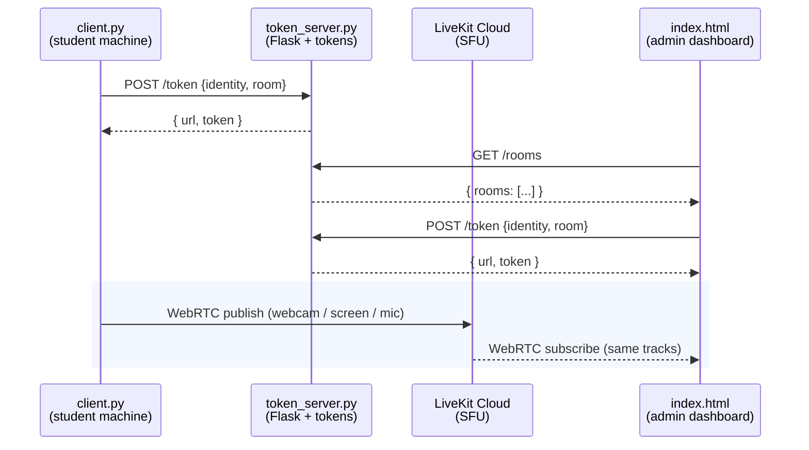

# Online Exam Proctoring System


[](https://camera-mic-screen-share-caputure-in.onrender.com)
[](https://livekit.io)

[](https://github.com/Binidu01/Camera-mic-screen-share-caputure-in-silent/stargazers)
[](https://github.com/Binidu01/Camera-mic-screen-share-caputure-in-silent/network/members)
[](https://github.com/Binidu01/Camera-mic-screen-share-caputure-in-silent/issues)
[](https://github.com/Binidu01/Camera-mic-screen-share-caputure-in-silent/blob/main/LICENSE)

A real-time, browser-based exam monitoring tool that streams live webcam video, screen activity, and microphone audio from a student's machine to an instructor dashboard. Built with Python, LiveKit (WebRTC), and Flask.

---

## Table of Contents

- [Overview](#overview)
- [Features](#features)
- [Architecture](#architecture)
- [Technology Stack](#technology-stack)
- [Prerequisites](#prerequisites)
- [Installation](#installation)
- [Configuration](#configuration)
- [Running the System](#running-the-system)
- [Deployment](#deployment)
- [Configuration Reference](#configuration-reference)
- [Security Considerations](#security-considerations)
- [Troubleshooting](#troubleshooting)
- [Ethical Use and Disclaimer](#ethical-use-and-disclaimer)
- [License](#license)

---

## Overview

The Online Exam Proctoring System provides near real-time monitoring of a student's environment during an online assessment. It captures three concurrent media streams — webcam, screen share, and microphone — encodes them client-side, and publishes them over WebRTC to a LiveKit room.

The dashboard is a single-page application with two views:

1. **Student list** — shows every PC currently publishing, one card per machine, auto-refreshing every 3 seconds.
2. **Live view** — click any student to open their stream. Screen share fills the right side at full HD, webcam sits in a square panel on the left, and audio plays automatically.

Each machine gets its own room (`student-<pcname>-<hash>`), so multiple students can be monitored simultaneously by multiple instructors without interfering with each other.

The system is designed for low bandwidth and low CPU overhead on the student machine, with adaptive stream quality handled automatically by the WebRTC transport layer.

---

## Features

### Student side (`client.py`)

- **Persistent identity** — the student ID is derived from hostname + MAC and cached to `~/.livekit_student_id`. Restarting the client reuses the same ID, so no duplicate cards on the dashboard.
- **Live webcam feed** — captured at 640×480, 15 fps, up to 1.2 Mbps.
- **Full HD screen share** — captured at 1920×1080, 8 fps, up to 6 Mbps, using LiveKit's `is_screencast` encoding mode for maximum text clarity.
- **Microphone streaming** — 48 kHz mono, 40 ms chunks, drop-newest queue to keep latency bounded.
- **Graceful shutdown** — Ctrl+C cleanly releases the webcam, audio stream, and LiveKit connection.

### Instructor side (`index.html`)

- **Two-page SPA** — no routing, no page reloads. The student list and live view are both in one HTML file.
- **Student picker** — a card per publishing PC with avatar, hostname, and live status. Search filter and manual refresh button included.
- **Auto-refresh** — the list polls `/rooms` every 3 seconds while you're on the list page.
- **Dual-view live layout** — square webcam panel on the left, big screen share on the right. No overlapping picture-in-picture.
- **Audio level meter** — real RMS from the incoming audio, not a fake animation.
- **Audio unlock on click** — clicking a student card unlocks audio playback in the same gesture, so no separate "click to enable audio" overlay is needed.
- **Per-track state indicators** — idle/live dots for camera and screen independently.

### Server side (`token_server.py`)

- **Per-room JWTs** — clients request a token for a specific room, so each student publishes to their own.
- **`/rooms` endpoint** — the admin API call runs in a dedicated thread with its own asyncio event loop, so it works under gunicorn/gevent (which has no running loop of its own).
- **Credentials from environment** — API keys are read from Render's environment variables, never committed to git.

---

## Architecture

The system consists of three components:



> The token server issues short-lived JWTs and lists active rooms. Media never passes through it — the LiveKit Cloud SFU routes it between publisher and viewer.

### Component Responsibilities

| Component | Role |
|---|---|
| `client.py` | Runs on the student machine. Fetches a publisher token for its own room, connects to LiveKit, and publishes webcam, screen, and mic tracks. |
| `token_server.py` | Flask backend. Issues JWTs to publishers and viewers, and exposes `/rooms` for the dashboard's student picker. |
| `templates/index.html` | Admin dashboard SPA. Lists active students, fetches viewer tokens, connects to LiveKit on click, and renders the subscribed tracks. |

---

## Technology Stack

**Backend**
- Python 3.9+
- Flask
- Flask-CORS
- `livekit-api` (server SDK for JWT generation)
- `gunicorn`

**Client (Capture)**
- OpenCV (`cv2`) — webcam capture
- `mss` — screen capture
- `sounddevice` — microphone capture
- NumPy — frame manipulation
- `requests` — token retrieval
- `livekit` (Python RTC SDK) — media publishing

**Frontend**
- HTML5, CSS3, vanilla JavaScript
- `livekit-client` UMD build (CDN)

**Infrastructure**
- LiveKit Cloud (WebRTC SFU)
- Render (token server + dashboard hosting)

---

## Prerequisites

- **For students (recommended path):** nothing but Windows and a webcam/microphone — the prebuilt `client.exe` from [Releases](https://github.com/Binidu01/Camera-mic-screen-share-caputure-in-silent/releases) needs no Python install.
- **For running `client.py` from source instead:** Python 3.9 or newer.
- A webcam and microphone on the student machine (screen share works without these).
- A modern browser (Chrome, Edge, Firefox, Safari) on the instructor's machine.
- Network access on UDP/TCP port 7882 (WebRTC media) and TCP 443 (signaling) to reach LiveKit Cloud.
- A LiveKit Cloud account with a project and API key — **only needed if self-hosting your own `token_server.py`.** Sign up at [livekit.io](https://livekit.io). Using the [live demo](https://camera-mic-screen-share-caputure-in.onrender.com/) requires no LiveKit account of your own.

---

## Installation

> **Most students don't need to install anything.** The teacher shares the prebuilt `client.exe` from [Releases](https://github.com/Binidu01/Camera-mic-screen-share-caputure-in-silent/releases) — the student just downloads and runs it. `token_server.py` and `templates/index.html` are already deployed at the [live demo](https://camera-mic-screen-share-caputure-in.onrender.com/), so there's nothing to host either. The steps below are only for running `client.py` from source, or for self-hosting the server.

### Option A: Prebuilt executable (recommended for students)

1. Go to the [Releases page](https://github.com/Binidu01/Camera-mic-screen-share-caputure-in-silent/releases).
2. Download the latest `client.exe`.
3. Run it. Windows/SmartScreen and the app itself will prompt for confirmation before anything starts — capture only begins once the student accepts.

No Python, no dependencies, nothing else to configure.

### Option B: Run `client.py` from source

**1. Clone the repository**

```bash
git clone https://github.com/Binidu01/Camera-mic-screen-share-caputure-in-silent.git
cd Camera-mic-screen-share-caputure-in-silent
```

**2. Create and activate a virtual environment**

```bash
python -m venv .venv

# Windows
.venv\Scripts\activate

# macOS / Linux
source .venv/bin/activate
```

**3. Install client dependencies**

```bash
pip install -r client-requirements.txt
```

> On Linux, `sounddevice` requires PortAudio (`sudo apt install libportaudio2`). On macOS, it is bundled with the Homebrew Python distribution.

### (Optional) Install server dependencies

Only needed if you're self-hosting `token_server.py` instead of using the live demo:

```bash
pip install -r requirements.txt
```

---

## Configuration

> Using the live demo? You can skip straight to [Running the System](#running-the-system) — `client.py` is already pointed at the hosted token server by default. This section only applies if you're self-hosting your own `token_server.py`.

### 1. Create a LiveKit project

1. Log in to the LiveKit Cloud dashboard.
2. Create a new project or select an existing one.
3. Navigate to **Keys** and generate an API key pair.
4. Copy the **API Key** and **API Secret** — the secret is shown only once.

### 2. Create the `.env` file

Create a file named `.env` in the project root:

```env
LIVEKIT_URL=wss://your-project.livekit.cloud
LIVEKIT_API_KEY=APIxxxxxxxxxxxxxx
LIVEKIT_API_SECRET=your_full_secret_here
```

### 3. Protect the `.env` file

Add the following to `.gitignore` before your first commit:

```gitignore
.env
.venv/
__pycache__/
*.pyc
.livekit_student_id
```

> **Important:** If the API secret is ever exposed — pasted into a chat, committed to Git, or shown in a screenshot — revoke the key immediately in the LiveKit dashboard and generate a new one. The secret grants full publish and subscribe access to your project.

### 4. Point the client at your own token server

Only needed if you're self-hosting. `client.py` defaults to the live demo's token endpoint:

```python
TOKEN_URL = 'https://camera-mic-screen-share-caputure-in.onrender.com/token'
```

To use your own deployment instead, change it to your server's endpoint:

```python
TOKEN_URL = 'https://your-server.example.com/token'
```

### 5. (Optional) Override the auto-generated student name

Every PC gets an ID automatically from its hostname and MAC. If you want a friendlier label, set an environment variable before running the client:

```bash
# Windows (cmd)
set STUDENT_NAME=Alice
python client.py

# Windows (PowerShell)
$env:STUDENT_NAME="Alice"; python client.py

# macOS / Linux
STUDENT_NAME=Alice python client.py
```

The dashboard will then show `Alice-<hash>` instead of `DESKTOP-A1B2C3-<hash>`.

---

## Running the System

`token_server.py` and `templates/index.html` are already running at the live demo — there's nothing to start or host for those.

### For students: run the shared executable

1. The teacher shares `client.exe` (from [Releases](https://github.com/Binidu01/Camera-mic-screen-share-caputure-in-silent/releases)).
2. Double-click it. Accept the confirmation prompt — capture only starts after this.
3. That's it. The webcam, screen, and mic tracks publish automatically to the live demo under a room named after the PC.

Expected console output:

```
Starting LiveKit publisher…
Student ID : MSI-f75537
Room       : student-MSI-f75537
Identity   : publisher-MSI-f75537
Got token, connecting to wss://bini-w60p6ccw.livekit.cloud
Connected to LiveKit room: student-MSI-f75537
Webcam opened with backend 700
Audio stream started: 48000 Hz, 40 ms chunks
Screen resolution: 1920x1080
Webcam resolution: 640x480
Audio track published
Webcam track published
Screen track published
```

### For running `client.py` from source instead

```bash
python client.py
```

On first run, `client.py` writes a persistent ID to `~/.livekit_student_id` and prints where it saved it. Subsequent runs reuse the same ID and skip that message.

### For the teacher: open the dashboard

Open the live demo in a browser: **https://camera-mic-screen-share-caputure-in.onrender.com/**

You'll land on the **student list**. Every publishing PC appears as a card with its hostname, an avatar, and a live status indicator. The list refreshes every 3 seconds, and there's a search box and a manual refresh button.

Click any student card to open the **live view**:

- The screen share occupies the large right-hand panel at full HD.
- The webcam sits in a square panel on the left, vertically centered.
- Audio plays immediately. The click that selected the student is what unlocks it, so no separate prompt is needed.
- Live level meter and per-track indicators are in the header and on each panel.
- Click **Back to students** to return to the list — the WebRTC connection is torn down cleanly and the auto-refresh resumes.

Multiple instructors can open the dashboard simultaneously. Each tab generates its own random viewer identity, so nobody gets kicked out and each instructor can watch a different student.

---

## Deployment

> **This section is for forking/self-hosting.** The live demo below is already deployed and ready to use — most people won't need anything past this note. Read on only if you want to run your own `token_server.py` and dashboard instead of using the shared one.

### Current Deployment URLs

| Component | URL |
|---|---|
| LiveKit WebSocket endpoint | `wss://bini-w60p6ccw.livekit.cloud` |
| Token server (backend) | `https://camera-mic-screen-share-caputure-in.onrender.com` |
| Token endpoint | `https://camera-mic-screen-share-caputure-in.onrender.com/token` |
| Rooms endpoint | `https://camera-mic-screen-share-caputure-in.onrender.com/rooms` |
| Live dashboard (demo) | `https://camera-mic-screen-share-caputure-in.onrender.com/` |

> The dashboard URL above is also the live demo — open it in a browser to see every currently-publishing student and click any card to watch their stream.

> **Local vs. Render:** Running `token_server.py` locally with `python token_server.py` is fine for quick testing, but it isn't a guaranteed stand-in for the Render deployment. Locally you're on Flask's built-in dev server with whatever `.env` values you have on disk; on Render you're on `gunicorn`, a dynamically assigned `PORT`, and environment variables set through the dashboard. If something works locally but fails on Render (or vice versa), it's almost always one of those three differences.

### Deploying to Render (step-by-step)

This is the exact workflow used to stand up the live deployment above. Render watches your GitHub repo and redeploys automatically on every push.

**Prerequisites** — confirm your repository has:

| File | Purpose |
|---|---|
| `token_server.py` | The Flask application entry point. |
| `requirements.txt` | Lists all Python dependencies, including `gunicorn`. |
| `templates/index.html` | The dashboard SPA, served at `/`. |
| `.gitignore` | Must include `.env`, `.venv/`, and `__pycache__/`. |

`requirements.txt` should contain at minimum:

```
flask
flask-cors
livekit-api
gunicorn
```

**Step 1 — Create a Render account.** Go to [render.com](https://render.com) and sign up, signing in with GitHub so Render can deploy from your repository automatically.

**Step 2 — Connect your GitHub repository.**
1. From the Render Dashboard, click **New +** → **Web Service**.
2. Authorize Render to access your GitHub account if prompted.
3. Select the repository containing your project.
4. Click **Connect**.

**Step 3 — Configure the web service.**

| Field | Value |
|---|---|
| **Name** | `camera-mic-screen-share-caputure-in` (or any name) |
| **Region** | Closest to your users |
| **Branch** | `main` |
| **Runtime** | `Python 3` |
| **Build Command** | `pip install -r requirements.txt` |
| **Start Command** | `gunicorn token_server:app` |
| **Instance Type** | `Free` (testing) or `Starter` (always-on) |

> **Start Command note:** the format is `gunicorn <filename_without_.py>:<flask_instance_name>`. For `token_server.py` with `app = Flask(__name__)`, that's `gunicorn token_server:app`.

Make sure your Flask app binds to the `PORT` Render provides, rather than a hardcoded port:

```python
if __name__ == '__main__':
    port = int(os.environ.get('PORT', 5000))
    app.run(host='0.0.0.0', port=port)
```

**Step 4 — Set environment variables.** Render does not read your local `.env` file — every secret has to be added through the dashboard.

1. In **Environment** (left sidebar), click **+ Add Environment Variable**.
2. Add each of:

| Key | Value |
|---|---|
| `LIVEKIT_URL` | `wss://bini-w60p6ccw.livekit.cloud` |
| `LIVEKIT_API_KEY` | `APIxxxxxxxxxxxxxx` |
| `LIVEKIT_API_SECRET` | *your actual secret* |

3. Click **Save Changes**.

**Step 5 — Deploy.** Click **Create Web Service** (or **Save, rebuild, and deploy** for an existing one). Render clones the repo, installs dependencies, and starts the service.

**Step 6 — Verify.**

1. Open `https://<your-service>.onrender.com/` — the dashboard should load and show the "Active Students" list.
2. Test the token endpoint:

```bash
curl -X POST https://<your-service>.onrender.com/token \
  -H "Content-Type: application/json" \
  -d '{"identity": "test", "room": "student-test"}'
```

   Expected response:

```json
{
  "url": "wss://bini-w60p6ccw.livekit.cloud",
  "token": "eyJhbGciOiJIUzI1NiIs..."
}
```

3. Test the rooms endpoint:

```bash
curl https://<your-service>.onrender.com/rooms
```

   Expected response when a student is connected:

```json
{
  "rooms": [
    {
      "name": "student-MSI-f75537",
      "num_participants": 1,
      "creation_time": 1757800000
    }
  ]
}
```

4. Run `client.py` on the student machine — it should fetch a token, connect, and appear within 3 seconds on the dashboard.

### Hosting Notes

**Render**
The free tier sleeps after approximately 15 minutes of inactivity. The first request after a sleep period may take 30–50 seconds to respond, which means the dashboard may show "No students online" until the token server wakes up. For always-on operation, use a paid instance or configure an external uptime monitor (e.g. UptimeRobot, cron-job.org) to ping `/healthz` every 10 minutes.

Every push to the connected branch triggers an automatic rebuild and redeploy. If the build fails, Render cancels the deployment and the previous version keeps running — check the **Logs** tab to diagnose failed builds.

To rotate the LiveKit API key later: update `LIVEKIT_API_KEY` / `LIVEKIT_API_SECRET` under **Environment**, then **Save Changes** → **Save, rebuild, and deploy**.

To use a custom domain instead of `.onrender.com`, go to **Settings → Custom Domains** and follow Render's DNS instructions.

**LiveKit Cloud**
The free Build tier includes 5,000 WebRTC participant minutes per month and 50 GB of downstream transfer. For one publisher and one viewer, that's roughly 2,500 minutes (~41 hours) of streaming per month. When the allowance is exhausted, new connections fail until the next month or an upgrade to the Ship tier. Monitor usage in the LiveKit dashboard.

Region selection matters for latency — LiveKit automatically routes to the nearest edge, so students and instructors in the same geographic area get the lowest latency. Instructors far from the students will see higher latency.

### Production Checklist

- [ ] Code pushed to the GitHub repository.
- [ ] `requirements.txt` includes all dependencies **and** `gunicorn`.
- [ ] Flask app binds to `os.environ.get('PORT', 5000)` — not hardcoded.
- [ ] `.env` excluded from version control.
- [ ] All environment variables set in Render's dashboard.
- [ ] Start command correctly references the filename and Flask instance (`gunicorn token_server:app`).
- [ ] HTTPS enforced on the token server (Render provides this by default).
- [ ] Deployment logs show no errors; `/`, `/token`, and `/rooms` all work.
- [ ] `client.py` connects successfully without a 401.
- [ ] API key rotated if it was ever exposed during development.
- [ ] Rate limiting applied to `/token` (see [Security Considerations](#security-considerations)).
- [ ] Token grants scoped per role (publisher vs viewer).
- [ ] Dashboard URL shared only with authorized instructors.

---

## Configuration Reference

### `client.py` Tunables

| Setting | Default | Description |
|---|---|---|
| `TOKEN_URL` | Deployment URL | Endpoint that issues publisher JWTs. |
| `DEBUG_TIMING` | `False` | When `True`, prints per-frame timing for `[cam]`, `[scr]`, and `[aud]`. Disable in production to reduce console noise. |
| Webcam `TARGET_FPS` | `15` | Frames per second for webcam capture. |
| Webcam resolution | `640x480` | Capture resolution. |
| Webcam max bitrate | `1.2 Mbps` | Encoder ceiling for the webcam track. |
| Screen `TARGET_FPS` | `8` | Frames per second for screen capture. |
| Screen resolution | `1920x1080` | Downscaled before publishing; native monitor resolution is preserved up to this size. |
| Screen max bitrate | `6 Mbps` | Encoder ceiling for the screen track; LiveKit scales down per viewer if bandwidth is tight. |
| Audio sample rate | `48000 Hz` | Matches LiveKit's preferred input rate. |
| Audio chunk size | `1920` samples | Approximately 40 ms per chunk. |
| Audio queue | `maxsize=4`, drop-newest | Discards the incoming chunk if the sender falls behind, keeping latency bounded. |

### Server Environment Variables

| Variable | Purpose |
|---|---|
| `LIVEKIT_URL` | LiveKit Cloud WebSocket URL (`wss://...`). |
| `LIVEKIT_API_KEY` | API key ID. |
| `LIVEKIT_API_SECRET` | Signing secret. Must never be exposed publicly. |
| `PORT` | Optional. HTTP port for the Flask server (defaults to `5000`). |

### Server Endpoints

| Endpoint | Method | Purpose |
|---|---|---|
| `/` | GET | Serves `templates/index.html` — the admin dashboard. |
| `/token` | POST | Issues a LiveKit JWT. Body: `{ "identity": "...", "room": "..." }`. |
| `/rooms` | GET | Lists active LiveKit rooms with participant counts. |
| `/healthz` | GET | Returns `ok` — used for uptime monitors. |

---

## Security Considerations

### Credential Handling

- Never commit `.env` to version control. Add it to `.gitignore` before the first commit.
- Rotate any API key that has been exposed. Revoke it in the LiveKit dashboard, generate a new one, and update `.env`.
- Do not log tokens. Remove any `print(token)` statements before deploying.
- Do not transmit API secrets to the browser. Token generation must occur server-side.

### Token Scoping

Issue tokens with the minimum grants required for each role:

- **Publisher token** (student client):
  - `canPublish = True`
  - `canSubscribe = False`
  - `canPublishData = False`

- **Viewer token** (instructor dashboard):
  - `canPublish = False`
  - `canSubscribe = True`
  - `canPublishData = False`

This prevents a compromised student client from subscribing to other students' streams and prevents a compromised viewer from injecting media. The current implementation grants both roles identical permission — consider splitting `/token` into `/token/publisher` and `/token/viewer` with distinct grants for stricter production deployments.

### Transport

- Use WSS (secure WebSocket) for all LiveKit connections. LiveKit Cloud enforces this.
- Serve the token endpoint over HTTPS. Render provides TLS automatically.

### Rate Limiting

A public token endpoint can be abused to generate unlimited credentials. Apply per-IP rate limiting before exposing the service:

```python
from flask_limiter import Limiter
from flask_limiter.util import get_remote_address

limiter = Limiter(get_remote_address, app=app, default_limits=["20 per minute"])
```

Install with `pip install flask-limiter`.

### Room Access Control

Every student currently gets its own room automatically (`student-<pcname>-<hash>`), so there's no cross-talk between students. To restrict which rooms an instructor can subscribe to, validate the requested room name against an allowlist before issuing a token.

---

## Troubleshooting

### `/rooms` returns `{"rooms": [], "error": "no running event loop"}`

The LiveKit Python SDK is async-only, but Flask running under gunicorn/gevent has no running asyncio event loop. The fix is in `token_server.py`: the `/rooms` handler spawns a dedicated thread with its own event loop, runs the async `LiveKitAPI` call there, and joins back. If you see this error, make sure the deployed version has the thread wrapper — the older `asyncio.run(_fetch())` form does **not** work under gunicorn.

### `/rooms` returns `[]` but the LiveKit dashboard shows the room

Check `LIVEKIT_HTTP_URL` in the Render logs. The admin API needs `https://`, not `wss://`. The URL is derived from `LIVEKIT_URL` by replacing the scheme; verify the derivation is working by looking at the startup log line `LiveKit HTTP URL: https://...`.

### `401 Unauthorized - invalid API key`

The token was signed with credentials that don't belong to the LiveKit project in the URL. Verify that `LIVEKIT_API_KEY` and `LIVEKIT_API_SECRET` match the project at `LIVEKIT_URL`. Common causes:

- The `.env` file isn't being loaded on the server (Render ignores `.env` — variables must be set in the dashboard).
- The terminal session has stale environment variables. Restart the terminal after editing `.env`.
- The key was rotated in the LiveKit dashboard but the local `.env` still has the old value.

### `401` despite correct credentials

Check the system clock. JWT validation allows only a small tolerance for clock skew. Sync the clock:

```bash
# Windows (Administrator)
w32tm /resync

# Linux
sudo timedatectl set-ntp true

# macOS
sudo sntp -sS pool.ntp.org
```

### Duplicate student cards for the same PC

This happens when `client.py` generates a different ID on each run — typically because `uuid.getnode()` returned a random value instead of the real MAC. The fix is in `client.py`: `make_student_id()` now persists the generated ID to `~/.livekit_student_id` and reuses it on every subsequent run. If you see duplicate cards, delete the file and restart the client once to generate a fresh stable ID. LiveKit will clean up the orphaned rooms within about a minute.

### Screen share looks blurry

The default `client.py` publishes screen at 1920×1080 with a 6 Mbps ceiling. If it's still blurry, the bottleneck is network, not code:

- Check the LiveKit Cloud dashboard under the student's room — the `Bitrate` reading on the screen track tells you what's actually being delivered.
- If it's below 1 Mbps despite the 6 Mbps cap, the student's upload or the viewer's download is limited. LiveKit scales down automatically.
- The viewer's screen can also just be scaled down by the browser. Try maximising the window or using fullscreen (F11).

### No audio on the dashboard

Browsers block autoplay of audio until a user gesture occurs. Clicking a student card is a gesture — that's when audio unlocks automatically. If it's still silent:

- Check that the viewer token includes `canSubscribe = True`.
- Verify the client printed `Audio track published`.
- Confirm the level meter in the header is showing movement — if it's moving, audio is arriving and the issue is the browser's output device.

### Webcam or screen not appearing

- Confirm the client printed `Webcam track published` and `Screen track published`.
- Check the browser console for subscription errors.
- Verify the dashboard is connected (the status pill should read "Watching: ...").
- On Windows, webcam capture may fail if another application (Teams, Zoom, OBS) has exclusive access to the device.

### High CPU usage on the student machine

Reduce `TARGET_FPS` for webcam (currently 15) or screen (currently 8), or lower the screen target resolution. The 1920×1080 screen encode is the heaviest operation on the client — dropping to `1280x720` roughly halves the CPU cost with minimal visual impact.

---

## Ethical Use and Disclaimer

This software is intended solely for lawful, consensual use in educational or assessment contexts. Recording a person's webcam, screen, and microphone without their knowledge or consent is illegal in most jurisdictions and violates the acceptable-use policies of virtually every educational institution.

By using this software, you agree to:

- Obtain explicit, informed, written consent from every individual being monitored.
- Comply with all applicable privacy and wiretapping laws, including but not limited to GDPR, CCPA, FERPA, and two-party consent statutes.
- Comply with your institution's student-privacy and acceptable-use policies.
- Comply with LiveKit Cloud's terms of service and acceptable-use policy.
- Store, transmit, and delete captured media in accordance with applicable data-protection regulations.

The authors and contributors of this project accept no liability for misuse, legal consequences, or damages arising from the use of this software. You are solely responsible for ensuring that your deployment is lawful and ethical.

---

## License

MIT License. See `LICENSE` for full text.

---

## Acknowledgements

- [LiveKit](https://livekit.io) — WebRTC infrastructure and SDKs
- [OpenCV](https://opencv.org) — computer vision primitives
- [mss](https://python-mss.readthedocs.io) — cross-platform screen capture
- [sounddevice](https://python-sounddevice.readthedocs.io) — PortAudio bindings
- [Render](https://render.com) — token server hosting
